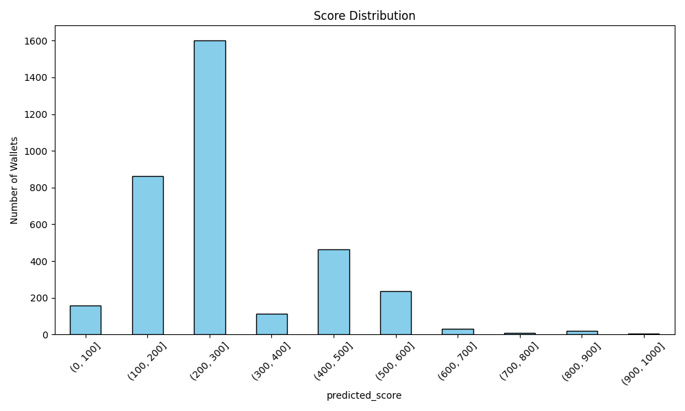

# Wallet Score Analysis

**Total Wallets Scored**: 3497

**Average Score**: 252.7

**Median Score**: 204.8

**Score Range**: 7 - 954

**MAE**: 3.57

**RMSE**: 10.78

**R²**: 0.9946

**High Scorers (900+)**: 0.09%

**Low Scorers (<100)**: 4.55%

---

## Methodology

- Repayment behavior, liquidation, and wallet age determine credit score.
- Scores are scaled to a 0–1000 range.
- Model used: RandomForestRegressor + MinMax scaling.
